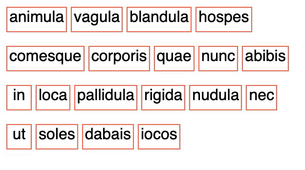

# react-spring-animated-grid

Animated grid responsive to width changes.

# Features

- Width aware animated reordering elements

# Install

`npm i react-spring-animated-grid`

# Preview

# Usage

```
import { GridComponent } from 'react-spring-animated-grid'
...
<GridComponent itemMarginRight={10} style={{ width: "300px" }}>
  {elements.map((e, i) => (
    <div
      className="item"
      key={e.text}
      onClick={() => toggleClicked(e.text)}
    >
      {!isClicked(e.text) && e.text}
    </div>
  ))}
</GridComponent>

```
# Demo

https://codesandbox.io/s/animated-grid-demo-ycu8x?file=/src/App.js:793-814
 